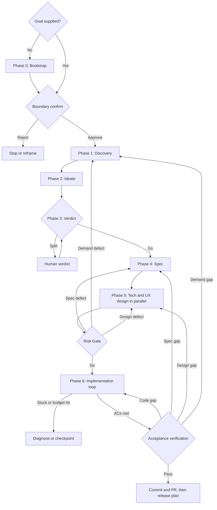

# Feature Lifecycle Phase Contracts

**Purpose:** The per-phase roster, conditional rows, and exit gate for Phase 0 → Ship, plus the chain template that shows sequencing and parallelism.
**Read when:** You are entering any phase, deciding whether a conditional row applies, or need the run skeleton.

Every row below names **work the chain owns**, not a skill it calls. Where a workspace ships a specialist for the row, the chain delegates to it; where it does not, the chain performs the work itself against the identical exit gate — the candidate names and each row's own fallback are in `reference/delegation-map.md`.

**Which engine role a row runs on is not here.** `reference/engine-roster.md` § Phase → Role Map owns that assignment for every row in this file, and this file does not restate it. Two copies of a roster drift the first time a row is added to one of them, and nothing mechanical catches it — so there is one copy, and the cross-file read is the price.

**Where a phase's output is written is not here either.** Each exit gate below is also a **seal point**: the phase's document in the run record is sealed in the same step that records the gate verdict, carrying the outcome, the findings the artifact does not, the rejected options, and the gate's measured terms — failures included. The directory, the document shape, and the append-only re-entry rule are `reference/run-record.md`.

## Contents
- Phase 0: Bootstrap (autonomous goal discovery)
- Phase 1: Discovery
- Phase 2: Ideate
- Phase 3: Verdict
- Phase 4: Spec
- Phase 5: Design + Risk Gate
- Ship
- Chain Template
- Topology Overview
- Workflow Shape Rationale

Phase 6 (implementation loop) and the acceptance verification live in `reference/loop-engine.md` — they cross an engine boundary and carry their own protocol.

---

## Phase 0: Bootstrap (Autonomous Goal Discovery)

**Trigger:** `feature-lifecycle` invoked with no goal, or `feature-lifecycle bootstrap` / `feature-lifecycle auto` / `goal=auto` (`SKILL.md` § Subcommand Dispatch). Skipped when a goal description is supplied.

**Purpose:** Propose a goal from available evidence, not assert an objectively highest-value product priority. `SKILL.md` § Modes bounds proposal work and requires explicit authority for expensive discovery, goal selection and launch; without it, stop at a read-only proposal.

### 0a. SCAN (parallel)

| Row | Required | Notes |
|-----|----------|-------|
| `project-scan` | Yes | git log (last 30 days), open PRs/issues, TODOs/FIXMEs in code, `.agents/PROJECT.md`, `CLAUDE.md`, README signals, recently-shipped feature flags awaiting cleanup |
| `user-signal` | Conditional | Real user feedback aggregation when any source is configured (NPS/CSAT/reviews/support tickets/sentiment) |
| `metric-signal` | Conditional | KPI/metric drops, funnel friction, cohort regressions when a metrics integration exists (GA4/Amplitude/Mixpanel/PostHog) |
| `competitor-gap` | Conditional | Competitor gap analysis when a competitor list is maintained |
| `session-replay` | Conditional | Session-replay behavioural signals when available |

With **no** external source configured — a greenfield repo with no users yet — fall back to "propose from the project scan only" and flag every candidate `confidence: low`. The fallback is declared, never silent.

### 0b. PROPOSE

| Row | Work |
|-----|------|
| `goal-proposal` | Propose only plausible distinct goals supported by 0a; a candidate count is not a quota. Each carries `title`, `hypothesis`, `evidence_refs`, `estimated_impact` (or `unknown`), `rough_scope`, `dependencies`. Do not manufacture candidates to fill a count. |

### 0c. PRIORITIZE

| Row | Work |
|-----|------|
| `goal-scoring` | Use ICE/RICE/WSJF only when the inputs and framework fit the decision. Each input names source, population, date, uncertainty and bias; missing input stays `unknown`, not an arbitrary score. A qualitative or partially ordered comparison is valid. Repository activity does not establish business value. Compliance/safety work may be constraint-led, not impact-scored. |
| `advisory-check` | Optional Socratic sanity check on the #1 candidate — does it pattern-match a known anti-pattern (premature scaling, vanity metric, founder ego project)? |

### 0d. SELECT

Compare supported trade-offs and sensitivity, not a fixed percentage margin. A score is a conditional estimate, not objective priority. When evidence cannot distinguish candidates, say so and present the unresolved choice; a delegated product choice must remain within the user's constraints. No supported goal → stop with the missing input, not a fabricated winner.

Emit `auto_selected_goal`:

```yaml
auto_selected_goal:
  title: <feature title>
  rationale: <why selected, evidence summary>
  evidence_refs: [project_scan/user_signal/metric_signal/competitor_gap refs]
  estimated_scope: Lite | Standard | Full
  estimated_cost: <agent_count_est>, <time_est>, <token_est>
  ui_surface: true | false
  api_change: true | false
  db_change: true | false
  rejected_alternatives: [(title, why_not), ...]
```

### 0e. CONFIRM (launch authority)

**Confirm-before-launch** tier — a launch gate on the expensive Phase 1-6 + Ship chain, not a deliverable checkpoint. Per-mode behavior is in `SKILL.md` § Modes.

Bind goal, scope, action limits and budget to the explicit grant in `RUN.md`; include rationale, actual alternatives and estimate uncertainty. A sufficient existing grant needs no duplicate approval. Otherwise present the proposal and stop without an answer. The downstream Ask First boundaries still apply; product choice is delegated only when the grant says so.

**Exit gate:** exactly one goal artifact, boundary-confirmed, bound as Phase 1 input.

---

## Phase 1: Discovery

| Row | Work | Required |
|-----|------|----------|
| `demand-modeling` | Optional synthetic scenarios for distinct relevant actors and edge cases; label them `hypothesis`, not observed demand. No persona quota | Only where scenario generation reduces an identified unknown |
| `evidence-validation` | For each decision-driving need, record provenance (`user-stated`, `observed`, `constraint`, `synthetic`), source/ref and supported scope; distinguish observation from inference | Yes |
| `friction-baseline` | Friction analysis on the current flow (emotional valence + dark-pattern audit) | Existing-product improvement only |
| `reuse-scan` | Reuse scan of the existing codebase | Existing repo (or inherited via `reuse_findings`) |

**Exit gate:** decision-driving needs carry provenance, support scope and claim status. An anchor supports the particular claim, not merely a related topic. Deduplicate shared observations: one ticket expanded into twenty personas is still one observation. Record missing sources and population bias; synthetic reactions cannot corroborate synthetic demands. A user-stated need is authority for that user's intent, not evidence of population demand. With no independent signal, keep demand as `hypothesis`: propose research, or proceed only within an explicitly authorized bounded experiment/goal that accepts that uncertainty. Do not invent research or require population research for a narrow authorized need. On an existing product, record the applicable friction baseline; the reuse scan has run or valid upstream findings were reused.

---

## Phase 2: Ideate

| Row | Work | Required |
|-----|------|----------|
| `option-generation` | Diamond thinking (Expand → Propose → Evaluate → Subtract), max 4 turns | Yes |

**Exit gate:** ≥2 comparable decision candidates ready for the verdict.

---

## Phase 3: Verdict

| Row | Work | Required |
|-----|------|----------|
| `deliberation` | Three-voice deliberation → verdict + AC seed | Yes |

The three voices and what each is asked:

| Voice | Asks |
|-------|------|
| `logic` | Does the option hold up on its own terms — assumptions, failure modes, internal contradictions? |
| `human-impact` | Who does it help, who does it cost, and what does the persona set actually do with it? |
| `precedent` | What have comparable systems already learned about this shape? |

**One voice per engine** where available (`reference/engine-roster.md` hard rule 2). Each verdict names the premise, evidence and oracle it actually challenged; three engines sharing one premise are not three independent observations (`reference/contracts.md` §3). Missing voices are listed in `simulated_voices`; the single-engine case remains honestly `context-only`.

**Exit gate:** the verdict carries (1) the chosen option, (2) an acceptance-criteria seed, (3) a scope boundary, (4) failure conditions. A 1-1-1 split escalates to human review, then re-enters Phase 3.

Skipped entirely when a Spec Handoff Packet supplied the direction — it was already picked and refuted upstream (`reference/input-contracts.md`).

---

## Phase 4: Spec

| Row | Work | Required |
|-----|------|----------|
| `spec-authoring` | L0 Vision → L1 Requirements → L2 Team Detail → L3 Acceptance Criteria + traceability | Yes |
| `scope-cutting` | YAGNI scope cutting | Conditional: spec scope = Full |
| `formal-spec` | Formal PRD/SRS/HLD/LLD, or an agent-consumable spec document | Conditional: M+ size or external review |
| `measurement-contract` | State how the demand will be assessed: quantitative metric or qualitative observation, reader and window; direction/size only where supported, otherwise `unmeasured` | Yes |

**Exit gate:** every authorized required or decision-critical obligation maps to measurable, loop-consumable L3 ACs and a verification oracle; optional gaps are explicitly identified, and a measurement contract exists (observable or explicitly unmeasurable with what would have to exist). Required includes must-haves and obligations needed for safety, compatibility or the requested usable outcome, regardless of their label. Preserve obligation IDs and the original intent/source through AC splitting and refinement. Removing, demoting or deferring a committed obligation requires an explicit user-authorized change, not a scope downgrade to pass a gate. Truly optional, pre-authorized deferrals may remain open. Traceability percentages are summaries with a stated denominator, not a 95/85/70% pass rule; adding easy ACs cannot discharge a missing obligation.

**The measurement contract is what closes Phase 0's hypothesis.** `goal-proposal` emits a `hypothesis` and an `estimated_impact`, and acceptance verification checks authorized intent, spec and implementation, not the eventual population outcome. A run can pass every gate at 100% conformance and still be a complete failure in the only sense Phase 0 cared about. The chain does not operate the service and cannot read the outcome itself; what it *can* do is refuse to ship a hypothesis with no way to settle it. The contract is authored here, in the same phase as the ACs, so Phase 6 can build the instrumentation it needs, and it leaves the run as an open residual (`reference/delivery-report.md` § Residual Ledger) rather than as a claim nobody will check.

Where the demand is genuinely unmeasurable — no analytics surface, no reachable users yet — record that as the contract, naming what would have to exist. An unmeasurable hypothesis stated as unmeasurable is honest; one stated as an impact estimate is not.

The **L3 AC set and the scope boundary are the two artifacts the whole downstream depends on**: the loop contract is built from the ACs, and the acceptance verification's negative pass is built from the boundary. A vague boundary here is what makes scope creep unprovable later.

---

## Phase 5: Design + Risk Gate

The two tracks run in parallel and reconverge at one gate.

### Tech Track

| Row | Work | Required |
|-----|------|----------|
| `architecture-decision` | Architecture decision + ADR (MADR/Nygard) + dependency graph | Yes |
| `api-design` | API design + OpenAPI document | Conditional: API change |
| `schema-design` | DB schema + migration plan | Conditional: DB change |

### UX Track

| Row | Work | Required |
|-----|------|----------|
| `ux-direction` | Creative direction + delegation plan; sub-orchestrates the rows below where a UX orchestrator is installed | Yes, when there is a UI surface |
| `design-tokens` | Design tokens (spacing, color, typography, dark mode) | Yes |
| `interaction-design` | Interaction design + a11y + cognitive load | Yes |
| `microcopy` | Microcopy, error/empty states, voice and tone | Yes |
| `motion-spec` | Animation / motion specification | Conditional: motion in scope |
| `design-file-extraction` | Design-file extraction and code mapping | Conditional: a design file is in the workflow |
| `prototype` | Rapid prototype (working slice) | Yes |
| `friction-walkthrough` | Cognitive walkthrough + WCAG 3.0 simulation + dark-pattern audit | Yes |
| `i18n-strategy` | i18n string-extraction strategy | Conditional: multi-locale |
| `mockup-to-code` | Mockup-to-code | Conditional: mockup supplied |

Internal pipeline: `ux-direction → design-tokens → [interaction-design ‖ microcopy ‖ motion-spec] → design-file-extraction? → prototype → friction-walkthrough`.

### Risk Gate (four axes, parallel, after both tracks)

| Row | Work | Pass criterion |
|-----|------|----------------|
| `failure-mode-analysis` | FMEA + RPN + 3-layer mitigation (Detection / Prevention / Recovery) | High-RPN residuals = 0, or a mitigation defined; AP-class A items require all three layers filled |
| `blast-radius-analysis` | Vertical + horizontal impact + blast radius | Go or Conditional-Go (No-Go blocks). On Conditional-Go, the mitigations must address the conditions before the loop contract is written |
| `friction-walkthrough` | Its UX friction signals fed into the gate (the same run as the UX track's row, read as a gate input) | Emotional valence ≥ median, dark patterns = 0, WCAG 3.0 Bronze ≥ 3.5, cognitive load within the target range |
| `security-review` | New attack surface, authn/authz on every new entry point, secrets and injection paths, new dependencies, the data class of anything newly persisted or transmitted, and the regulatory exposure that follows | Unmitigated high-severity findings = 0; every new entry point carries a declared authz rule; every newly persisted or transmitted field carries a declared data class |

**`security-review` is required, not conditional.** A change that touches no entry point, no persisted data, and no dependency passes it in one pass by recording `no-surface` **with the evidence for that claim** — which costs almost nothing. Making the row conditional would let it be skipped by exactly the judgment call it exists to make, and a feature whose own author believed it had no surface is the common shape of the finding. The chain's trigger list names API contract changes, DB migrations, and customer-facing surfaces as *reasons to run the chain at all*; a gate that never asks what those expose is a gate with a hole where its most expensive failure lives.

**Demand↔reaction check:** name the observation type and source: real user observation, existing behavior evidence, prototype test or synthetic walkthrough. A synthetic walkthrough checks consistency and possible friction, not actual user reaction or validation of its own demand hypothesis. Material contradictory evidence returns to the first wrong decision: P1 for demand, P4 for specification, P5 for interaction/design; a changed product goal reopens launch authority. Missing real reaction stays unknown and the measurement contract stays `hypothesis-open`; do not claim closure from model agreement.

**Required evidence:** before implementation, identify the integration and recovery evidence needed for each material failure mode in the existing risk result/loop contract, with a reason. Destructive migrations, payment/auth changes and external contracts need representative integration/recovery evidence where local checks cannot expose the critical failure; a safe sandbox, consumer harness or production-shaped isolated data may supply it. Do not require a new staging environment for low-risk reversible work whose independent local oracle suffices. Availability changes whether evidence can be obtained, not whether it is necessary.

**Exit gate:** `go = blast_radius.verdict ∈ {Go, Conditional-Go} ∧ failure_modes.high_rpn_count == 0 ∧ friction.gate_pass ∧ security.unmitigated_high == 0`. On No-Go, return to the first wrong decision — P1 for a demand defect, P4 for a spec defect, the failing P5 track for a design defect; changed goals reopen launch authority.

---

## Ship

| Row | Work | Required |
|-----|------|----------|
| `commit-and-pr` | Commit policy, branch strategy, PR preparation | Yes |
| `release-plan` | Release plan + CHANGELOG + rollback plan, carrying the Phase 4 measurement contract forward | Yes |
| `rollback-rehearsal` | Execute the rollback plan — not read it. Where the change includes a migration, exercise the down-path against production-shaped data | Yes |

**A rollback plan nobody has run is E0** by the chain's own evidence ladder (`reference/contracts.md` §3): a model asserting that a reversal would work. Its trigger list names high reversibility cost as a *reason to run the chain at all*, and the forward path is gated with four axes and a two-sided verification while the reverse path is left as prose. The rehearsal is what makes the reverse path evidence.

Where rehearsal is genuinely impossible, record `rollback_verified: declared-impossible` with the reason; do not mark it `true`. Impossibility is not exemption or permission to ship. Identify applicable compensating controls (for example verified backup/restore, idempotency/refund, recipient checks or progressive exposure), their observed tests and residual risks. Ship requires the recovery evidence P5 specified and explicit acceptance of the remaining irreversible risk by an authorized user; reuse an existing specific acceptance, never infer it from silence or AUTORUN_FULL. A human assertion cannot replace runtime evidence. With missing controls/evidence/authority, stop with a blocked residual; no environment is not the same as no recovery obligation.

**Exit gate:** required recovery evidence is met and the Delivery Report is emitted. `rollback_verified: true` names the exercised path; `declared-impossible(reason)` also requires verified compensating controls and explicit residual-risk acceptance. Neither state waives unmet required ACs or scope violations. Preparing local artifacts or a blocked PR is not release readiness; opening/pushing a PR and external release actions still require authorization.

---

## Chain Template

The skeleton below starts only after admission and authority per `SKILL.md`; without a grant, stop at the read-only proposal, with no lifecycle spawns. Rosters and exits are canonical above.

```
# ── Goal-supplied mode ───────────────────────────────
feature-lifecycle run goal="<feature description>"
  → [engine_probe] claude ‖ codex ‖ agy → resolve build / judge / breadth
                             └─ record the roster before the first spawn
  → Phase 1 Discovery        [parallel] demand-modeling? ‖ evidence-validation
                                      ‖ friction-baseline? ‖ reuse-scan?
  → Phase 2 Ideate           option-generation(max_turns=4)
  → Phase 3 Verdict          deliberation[logic ‖ human-impact ‖ precedent]
                             → verdict + ac_seed   [gate: split → human_review]
  → Phase 4 Spec             spec-authoring(scope=auto) → scope-cutting? / formal-spec?
                             → measurement-contract
  → Phase 5 Design           [parallel:Tech] architecture-decision + api-design? + schema-design?
                           ‖ [parallel:UX]   ux-direction → design-tokens
                                                    → [interaction-design ‖ microcopy ‖ motion-spec?]
                                                    → design-file-extraction? → prototype
                                                    → friction-walkthrough
     [Risk Gate]             failure-mode-analysis ‖ blast-radius-analysis
                           ‖ friction-walkthrough  ‖ security-review
                             └─ No-Go → first wrong decision (P1, P4 or P5 track)
  ── Phase 6 Implementation Loop (engine boundary) ────
  → [engine_check] build.spawns ∧ judge != build ∧ agents.max_depth≥2 ∧ subagent_tools_permitted
       └─ NG → Engine Degradation Protocol (confirmed choice; never a silent fallback)
  → loop_driver(contract = L3 ACs + mitigations + friction signals + measurement + required evidence)
       └─ per-cycle spawn sequence + audit → `reference/loop-engine.md`
  → Acceptance Verification  conformance + negative pass   [judge, never build]
                             + integration-evidence pass?   → E5 | unavailable
                             └─ fail → first wrong decision; code → P6 (max 2 total re-entries), then user
  → Ship                     commit-and-pr → release-plan → rollback-rehearsal
                             [gate: required recovery evidence; impossible → controls + risk acceptance]


# ── Autonomous mode (no goal supplied) ───────────────
feature-lifecycle             # or: feature-lifecycle auto / feature-lifecycle goal=auto
  → Phase 0 Bootstrap        0a SCAN [parallel] → 0b goal-proposal
                             → 0c goal-scoring + advisory-check?
                             → 0d select → 0e boundary_confirm (per-Mode)
  → Phase 1-6 + Ship         exactly the goal-supplied chain above, with
                             `auto_selected_goal` bound as Phase 1 input
```

## Topology Overview



The diagram is explanatory only. The phase contracts, gates, rosters, budgets, and failure behavior in this file remain canonical.

## Workflow Shape Rationale

Hierarchical decomposition is used only where a large roster has real context or authority boundaries. `ux-direction` and the loop driver become sub-orchestrators — when a skill is installed for them — because each owns a distinct merge surface; the chain does not create role-name-only supervisors. Where neither is installed, the chain runs both rosters directly and the topology flattens to one tier with every gate unchanged.

- Tech and UX work independently, but both reconverge at one Risk Gate before any code is written.
- Every sequential phase emits a typed artifact consumed by the next and has an explicit exit gate.
- The loop driver owns the bounded implementation loop; the chain owns the cross-phase checkpoints and the final aggregation.
- Adding another phase or hub requires a distinct owner, an artifact boundary, and a verification benefit — not an assumed reliability percentage.
